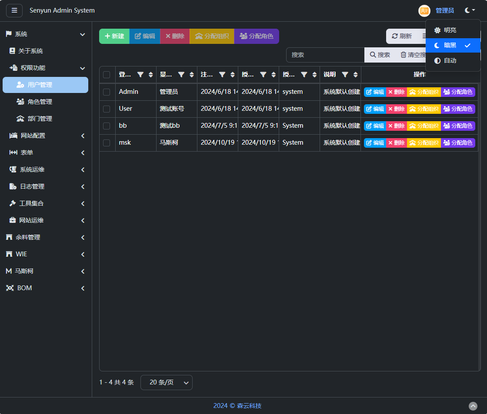
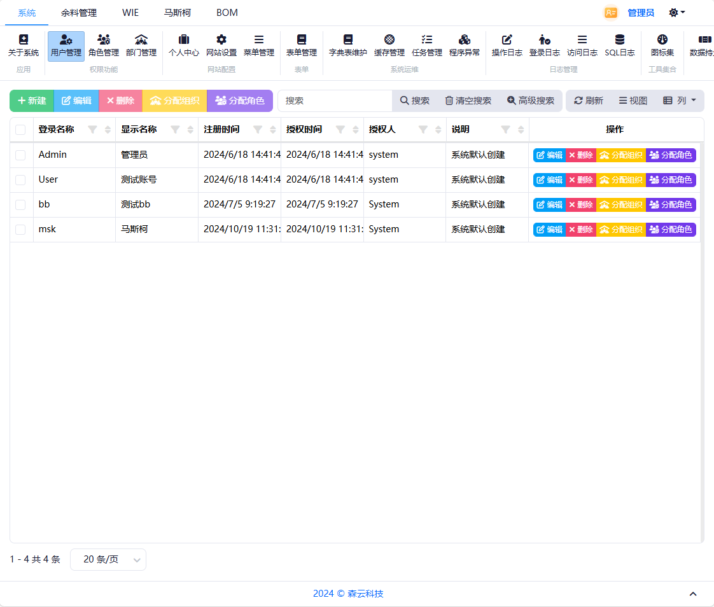
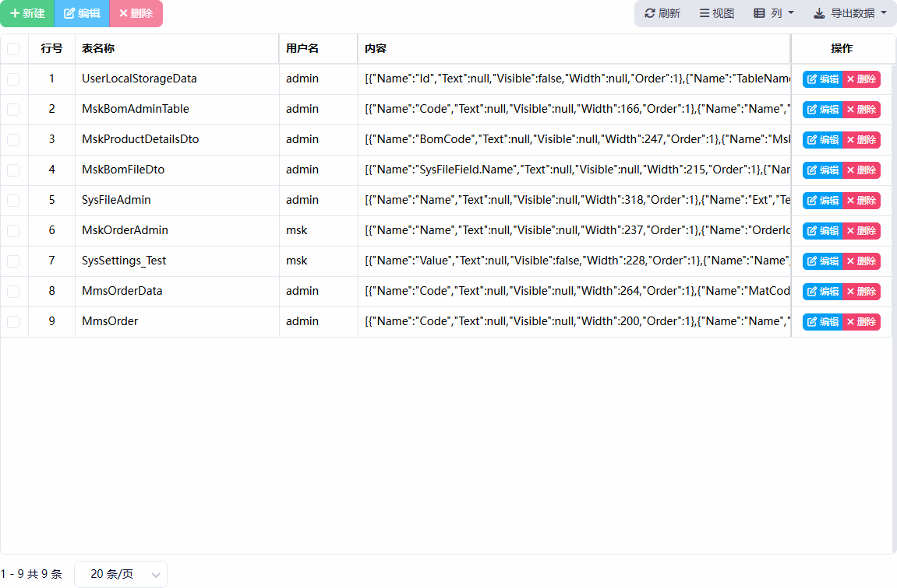
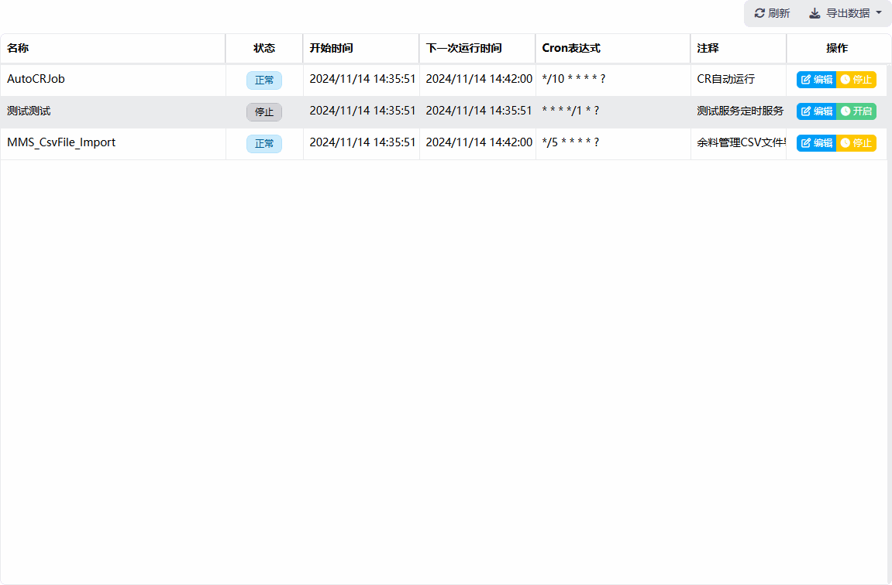
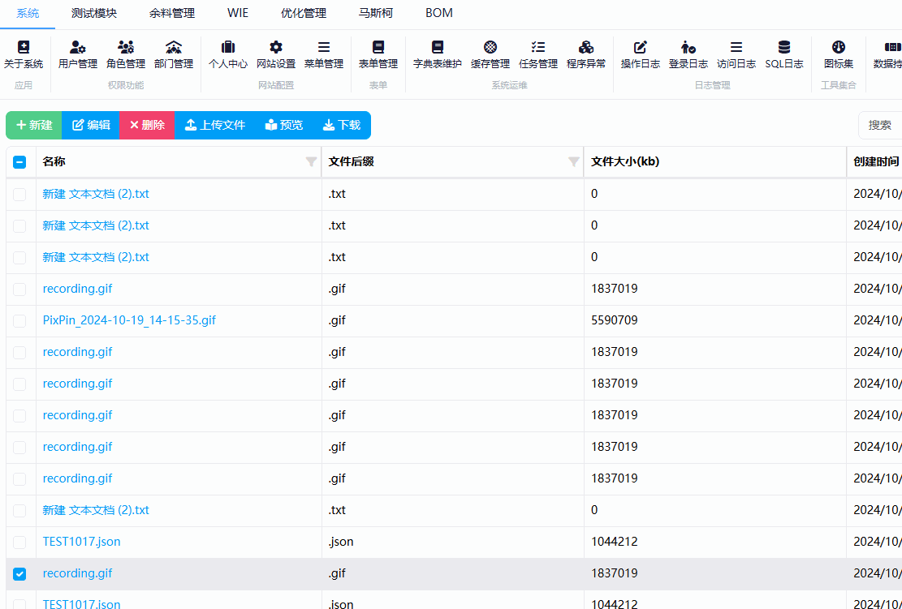
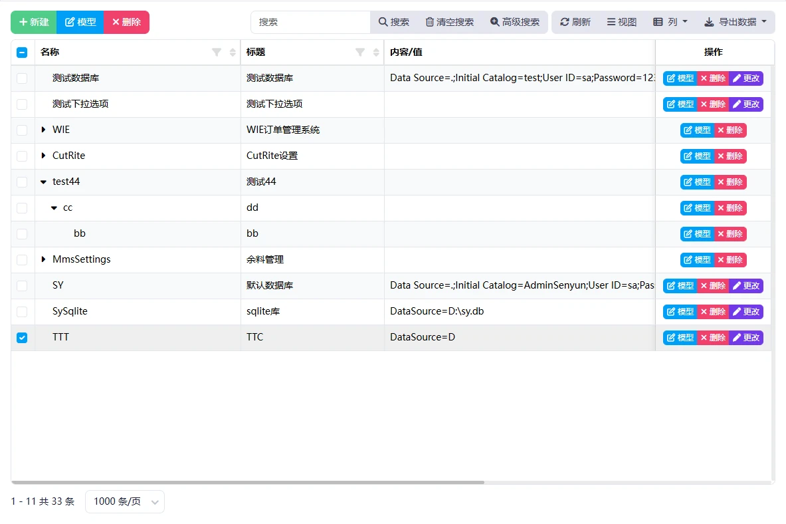
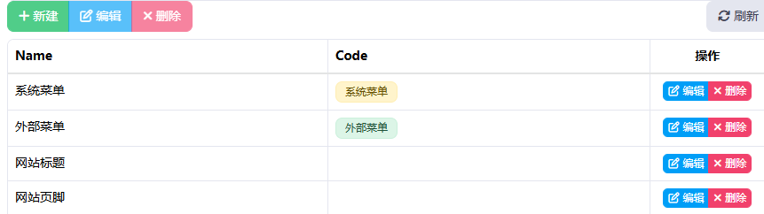
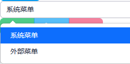
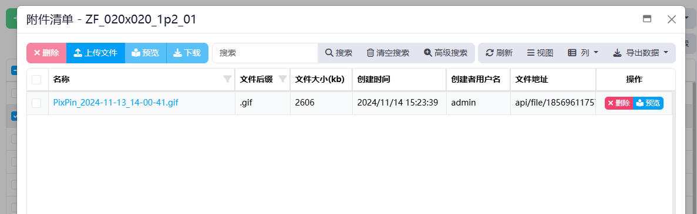

# Blazor Admin 管理系统





###### 体验地址 [http://ba.4je.cn/](http://ba.4je.cn/)

###### 登录 Admin ：123789

#### 框架文件结构

| 名称                 | 说明                | 类       |
| ------------------ | ----------------- | ------- |
| Plugins            | 插件项目，发布后项目DLL文件存储 | Plugin  |
| AdminSenyun.Models | 数据/模型             | Model   |
| AdminSenyun.Data   | 数据/服务             | Data    |
| AdminSenyun.Core   | 控件/功能             | Core    |
| AdminSenyun.Sys    | 系统/服务（系统管理服务）     | Sys     |
| AdminSenyun.Server | 服务启动              | Server  |
| ProPublish         | 系统发布工具            | Publish |

#### 功能选项

系统控件基于 Bootstrap Blazor 。

| 用户管理 | 增删改查 | ✅   |
|:----:|:----:|:---:|
|      | 分配组织 | ✅   |
|      | 分配角色 | ✅   |

| 角色管理 | 增删改查 | ✅   |
|:----:|:----:|:---:|
|      | 用户组  | ✅   |
|      | 组织分配 | ✅   |
|      | 菜单分配 | ✅   |

| 部门管理 | 增删改查 | ✅   |
|:----:|:----:|:---:|
|      | 分配用户 | ✅   |
|      | 分配角色 | ✅   |

| 个人中心 | 基本资料 | ✅   |
|:----:|:----:|:---:|
|      | 修改密码 | ✅   |
|      | 头像设置 | ✅   |

| 网站设置 | 系统名称 | ✅   |
|:----:|:----:|:---:|
|      | 网站标题 | ✅   |
|      | 页脚设置 | ✅   |
|      | 主题   | ❌   |
|      | 功能设置 | ❌   |
|      | 周期设置 | ❌   |

| 菜单管理 | 增删改查 | ✅   |
|:----:|:----:|:---:|
|      | 分配角色 | ✅   |
|      | 权限管理 | ✅   |

| 菜单管理 | 增删改查 | ✅   |
|:----:|:----:|:---:|
|      | 分配角色 | ✅   |
|      | 权限管理 | ✅   |

| 表单管理 | 增删改成 | ✅   |
|:----:|:----:|:---:|
|      | 设计   | ✅   |
|      | 增添数据 | ✅   |
|      | 复制新增 | ✅   |

| 字典管理 | 增删改成 | ✅   |
|:----:|:----:|:---:|
|      | 样式   | ✅   |
|      | 字典颜色 | ✅   |

| 缓存管理 | 清理缓存 | ✅   |
|:----:|:----:|:---:|
|      | 单例删除 | ✅   |

| 任务管理 | 编辑Cron表达式 | ✅   |
|:----:|:---------:|:---:|
|      | 持久存储      | ✅   |
|      | 暂停        | ✅   |

| 登录日志 | 查看日志 | ✅   |
|:----:|:----:|:---:|
|      | 日志记录 | ✅   |

| 数据持久 | 增删改查 | ✅   |
|:----:|:----:|:---:|
|      |      |     |

| 系统设置 | 增删改查           | ✅   |
|:----:|:--------------:|:---:|
|      | SQLServer 样式编辑 | ✅   |
|      | Sqlite 样式编辑    | ✅   |
|      | Access 样式编辑    | ✅   |
|      | 字符串样式          | ✅   |
|      | 下拉样式           | ✅   |

| 文件管理 | 增删改查 | ✅   |
|:----:|:----:|:---:|
|      | 上传文件 | ✅   |
|      | 预览   | ✅   |
|      | 下载   | ✅   |

##### 

 







### 重写控件

字典样式



增加字典使用时候只需要  在字段上标记  [Dict("XXX")]    XXX:字段分组

TableColumns 使用  WenTableColumn 自定识别 Dict

```
//增加 字典样式
[AttributeUsage(AttributeTargets.Property)]
public class DictAttribute(string category) : Attribute
{
    public string Category { get; set; } = category;
}
```

```
    public class sysDict
    {
        [Key]
        public long id { get; set; }
        public string Name { get; set; }

        [Dict("菜单")]
        public string Code { get; set; }
    }
```

```
<Table TItem="sysDict" ShowToolbar="true" IsBordered="true" ShowExtendButtons="true">
    <TableColumns>
        <WenTableColumn @bind-Field=context.Name></WenTableColumn>
        <WenTableColumn @bind-Field=context.Code></WenTableColumn>
    </TableColumns>
</Table>
```

##### 表格控件（WenTable）

    服务器列样式存储样式 只需要添加参数 ColumnPersistenceStoreName

    当不同数据库列表时候 只需要设置新的数据库参数 SqlSugarClient

    重写数据库连接服务： 当类继承 IEntityBase 后，自动 创建事件倒序

##### 字典下拉选项（WenSelect）

    设置DictCategory  自定读取设置



#### 样式列表组件 (WenListGroup)

增加 QueryAsync委托

#### 文件管理服务（AdminSysFile）

    系统文件包含上传 下载预览等功能



通过 OnQueryAsync 回调 返回 文件 ID 数组

#### 插件功能

    不需要添加引用，发布版本  只需要将 dll文件放在 Plugins 目录下 自动加载

    DEBUG模式  \bin\Debug 下文件

  使用时候，只需要 Plugins创建项目

#### 发布工具 （ProPublish）

设置文件存储路径

```
 public static string ProFolder = "D:\\CSDATA\\AdminSenyun\\AdminSenyun";
```

#### 定时任务（IJob）

```
    [Description("测试服务定时服务")]
    [Cron("*/1 * * * * ?")]
    [DisplayName("测试测试")]
    [DisallowConcurrentExecution]
    internal class TestJob : IJob
    {
        public Task Execute(IJobExecutionContext context)
        {
            Console.WriteLine(context.NextFireTimeUtc?.LocalDateTime);
            Console.WriteLine(context.JobRunTime);
            Console.WriteLine(context.Trigger);
            Console.WriteLine(context.JobDetail);
            Task.Delay(1000).Wait();
            Console.WriteLine("执行任务完成");
            return Task.CompletedTask;
        }
    }
```